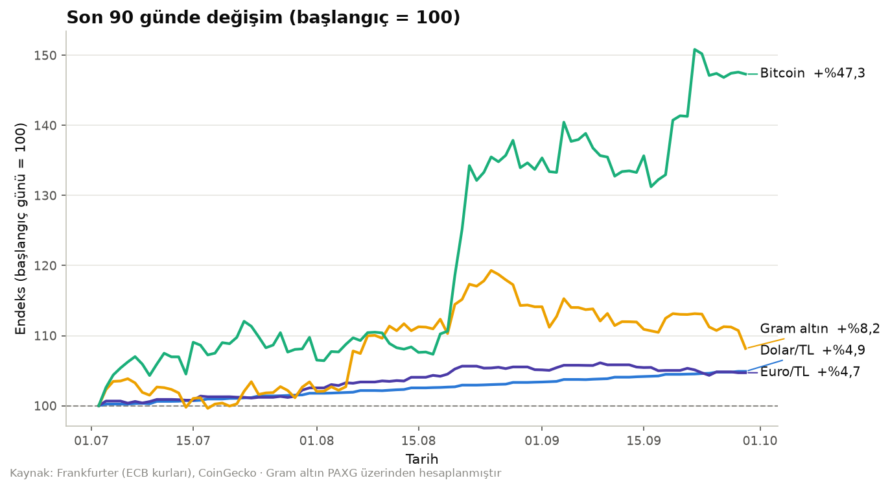
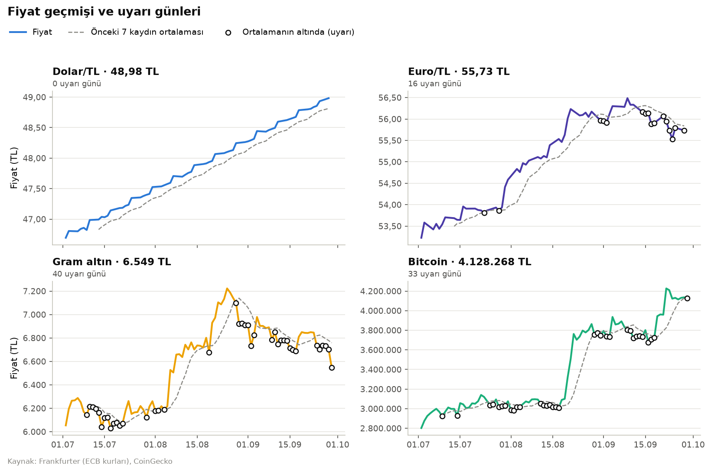

# Fiyat Takip Botu

[Türkçe](#türkçe) · [English](#english)

Dolar, euro, gram altın ve bitcoin fiyatlarını **her gün otomatik** kaydeden, fiyat son 7 kaydın ortalamasının altına düştüğünde uyarı veren küçük bir Python sistemi. GitHub Actions'ta kendi kendine çalışıyor; veri her gün büyüyor.



---

## Türkçe

### Nasıl çalışıyor

```
her gün 10:00 (TSİ)
   │
   ├─ testler (pytest)
   ├─ fiyat_takip.py ── API'lerden son fiyatı çek ──► SQLite'a yaz
   │                    └─ önceki 7 kaydın ortalamasının altında mı? ──► uyarı
   │                                                                     (ekran, Actions özeti, Telegram)
   ├─ grafik.py ─────── veritabanından grafikleri yeniden çiz
   └─ değişen veritabanı ve grafikleri repoya commit'le
```

### Dosyalar

| Dosya | Görevi |
|---|---|
| `ayarlar.py` | Takip edilen varlıklar, veritabanı yolu, 7 kayıt / 90 gün gibi ayarlar |
| `kaynaklar.py` | Frankfurter (döviz) ve CoinGecko (altın, bitcoin) API'lerinden fiyat çekme; hız sınırına karşı yeniden deneme |
| `veritabani.py` | SQLite tabloları, fiyat kaydı (aynı gün tekrar çalışırsa çift kayıt oluşmaz), uyarı kaydı |
| `analiz.py` | Uyarı kuralı: fiyat < önceki 7 kaydın ortalaması |
| `bildirim.py` | Uyarıyı ekrana, GitHub Actions özet sayfasına ve (ayarlıysa) Telegram'a iletme |
| `fiyat_takip.py` | Günlük çalışan ana betik |
| `gecmis_yukle.py` | İlk kurulumda son 90 günü doldurur, böylece kural ilk günden çalışır |
| `grafik.py` | İki grafik üretir: endeksli karşılaştırma ve varlık bazında geçmiş |
| `tests/` | Uyarı kuralı ve veritabanı için birim testleri |
| `yerel_calistir.bat` | Botu Windows Görev Zamanlayıcı ile bilgisayarda çalıştırmak için |

### Bulgular (ilk analiz, 29.09.2026)

1. Son 90 günde **bitcoin %47,3**, **gram altın %8,2**, **dolar %4,9**, **euro %4,7** değer kazandı (TL bazında).
2. **Dolar/TL 90 günde bir kez bile** önceki 7 kaydın ortalamasının altına inmedi — kesintisiz, neredeyse doğrusal bir yükseliş. Aynı dönemde bu kural gram altında 40, bitcoinde 33, euroda 16 gün tetiklendi.
3. İlk çalıştırmada gram altın son 7 kaydın ortalamasının **%3,1 altındaydı**; dört varlık içindeki en belirgin kısa vadeli düşüş buydu.



### Veri

- **Döviz:** [Frankfurter](https://frankfurter.dev) — Avrupa Merkez Bankası referans kurları (iş günlerinde güncellenir)
- **Altın ve bitcoin:** [CoinGecko](https://www.coingecko.com) — gram altın, 1 ons altına endeksli PAXG token'ının TL fiyatından hesaplanıyor (1 ons = 31,1035 g)
- **Veritabanı:** [`veri/fiyatlar.sqlite`](veri/fiyatlar.sqlite) — başlangıçta 308 satır (01.07.2026 – 29.09.2026), her gün 4 satır ekleniyor

### Çalıştırma

```bash
pip install -r requirements.txt
python gecmis_yukle.py   # ilk seferde: son 90 günü doldur
python fiyat_takip.py    # günlük kontrol
python grafik.py         # grafikleri üret
pytest                   # testler
```

**Otomatik çalıştırma — iki seçenek:**

1. **GitHub Actions** (bu repoda açık): [`.github/workflows/fiyat-takip.yml`](../.github/workflows/fiyat-takip.yml) her gün çalışır. Actions sekmesinden **Run workflow** ile elle de tetiklenebilir.
2. **Kendi bilgisayarında:** Windows'ta şu komut botu her gün 10:00'da çalıştıran bir görev oluşturur. Bilgisayardaki kopya ayrı bir veritabanı (`veri/yerel.sqlite`) kullanır, çıktısını `veri/yerel_kayit.txt`'ye yazar.
   ```bat
   schtasks /Create /SC DAILY /ST 10:00 /TN "FiyatTakipBotu" /TR "C:\veri-bilimi-projeleri\04-fiyat-takip-botu\yerel_calistir.bat"
   ```

**Telegram bildirimi (isteğe bağlı):** repo → Settings → Secrets and variables → Actions altına `TELEGRAM_BOT_TOKEN` ve `TELEGRAM_CHAT_ID` eklenirse uyarılar telefona da gelir. Tanımlı değilse bot sessizce atlar.

### Neyi farklı yapardım

- **Kural fazla hassas.** "Ortalamanın altında" kuralı oynak varlıklarda (bitcoin, altın) 90 günün üçte birinde tetikleniyor — bu bir uyarı değil, gürültü. Varlığın kendi oynaklığına göre eşik (ör. ortalamanın 1 standart sapma altı) çok daha anlamlı olurdu.
- **Türkiye piyasasına özel kaynak.** ECB kurları Avrupa saatine göre ve hafta sonu yok; gram altın da PAXG üzerinden yaklaşık. TCMB EVDS ve yerel altın fiyatları daha doğru olurdu (ücretsiz ama API anahtarı istiyor).

---

## English

**Price tracker bot.** A small Python system that records USD/TRY, EUR/TRY, gram gold and Bitcoin prices **every day** and raises an alert when a price drops below the average of its previous 7 records. It runs on its own via GitHub Actions, so the dataset grows daily.

**How it works:** a daily workflow runs the tests, fetches the latest prices (Frankfurter for FX, CoinGecko for gold and Bitcoin), writes them to SQLite (idempotent upserts, so re-runs never create duplicates), checks the alert rule, reports alerts to the console, the Actions run summary and optionally Telegram, redraws the charts and commits the updated database.

**Files:** `ayarlar.py` (settings) · `kaynaklar.py` (API clients with retry) · `veritabani.py` (SQLite) · `analiz.py` (alert rule) · `bildirim.py` (notifications) · `fiyat_takip.py` (daily entry point) · `gecmis_yukle.py` (90-day backfill) · `grafik.py` (charts) · `tests/` (pytest) · `yerel_calistir.bat` (Windows Task Scheduler runner).

**Findings (first run, 2026-09-29):**
1. Over 90 days in TRY terms: **Bitcoin +47.3%**, **gram gold +8.2%**, **USD +4.9%**, **EUR +4.7%**.
2. **USD/TRY never once** fell below its previous 7-record average in 90 days — a steady, almost linear climb. The same rule fired on 40 days for gold, 33 for Bitcoin and 16 for EUR.
3. On the first live run gold was **3.1% below** its 7-record average — the sharpest short-term drop of the four.

**Stack:** Python · requests · SQLite · pandas · matplotlib · pytest · GitHub Actions

**What I'd do differently:** make the alert volatility-aware (e.g. one standard deviation below the average) since the plain rule fires on a third of days for volatile assets; and use Turkey-specific sources (CBRT EVDS, local gold prices) instead of ECB rates and a PAXG-based gold estimate.
