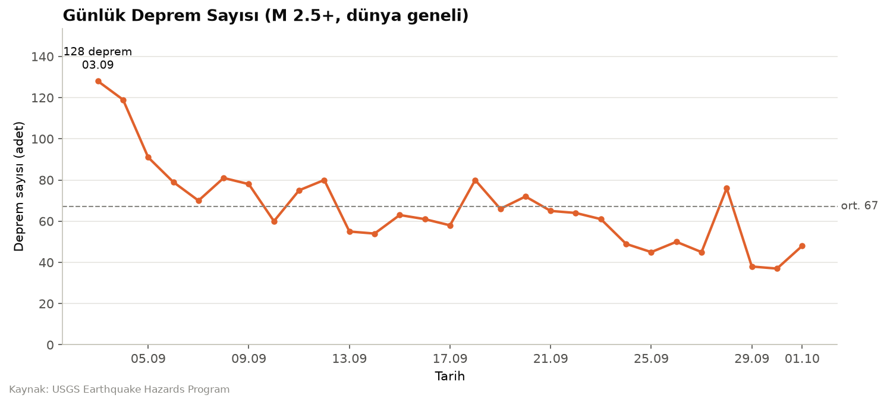

# Son 30 Günün Depremleri — İnteraktif Harita

USGS'in açık deprem servisinden son 30 günde dünyada yaşanan M2.5+ depremleri çekip büyüklüğe göre renklendirilmiş, tıklanabilir bir haritaya basan Python projesi.



### 🗺️ [Haritayı canlı aç](https://furkansoysal.github.io/veri-bilimi-projeleri/05-canli-veri-haritasi/cikti/deprem_haritasi.html)

Harita ve grafik **her sabah 06:00'da (TSİ) GitHub Actions ile otomatik yenileniyor** — link her zaman son 30 günü gösterir.

HTML dosyası: [`cikti/deprem_haritasi.html`](cikti/deprem_haritasi.html) — indirip tarayıcıda da açabilirsin, kurulum gerekmiyor.

## Özellikler

- Her deprem bir daire: **renk ve boyut** büyüklükle birlikte artıyor (renk ayırt edemeyen biri de boyuttan okuyabilsin diye)
- Daireye tıklayınca: büyüklük, yer, Türkiye saatiyle tarih, derinlik, USGS detay linki
- Büyüklük sınıfları ayrı katmanlar halinde, menüden açılıp kapatılabiliyor
- Fay hatlarını gösteren **ısı haritası** katmanı
- İki altlık seçeneği (sade gri / OpenStreetMap), tam ekran modu, telefonda da düzgün görünüm

## Bulgular (ilk analiz, 29.09.2026)

1. Son 30 günde **1970** M2.5+ deprem oldu, yani günde ortalama **66**. Depremlerin büyük çoğunluğu Pasifik Ateş Çemberi üzerinde.
2. En büyüğü **M6.6** (Yeni Kaledonya, 26.09.2026). M5 ve üzeri deprem sayısı 156, yani toplamın yalnızca **%7.9**'u.
3. En yoğun gün **03.09.2026** oldu: 127 deprem, ortalamanın neredeyse iki katı. Sonraki günlerde sayı yavaş yavaş ortalamaya iniyor.

## Veri

- **Kaynak:** [USGS Earthquake Hazards Program](https://earthquake.usgs.gov/earthquakes/feed/v1.0/geojson.php), `2.5_month.geojson` akışı (ücretsiz, üyelik yok)
- **Boyut:** 1970 satır × 7 sütun (zaman, enlem, boylam, derinlik, büyüklük, yer, url)
- Veri her çalıştırmada güncel olarak yeniden çekiliyor.

## Otomatik güncelleme

[`.github/workflows/deprem-haritasi.yml`](../.github/workflows/deprem-haritasi.yml) her gün notebook'u çalıştırıyor, `cikti/` klasöründe değişiklik varsa commit'leyip push ediyor; GitHub Pages de yeni haritayı yayınlıyor. Actions sekmesinden **Run workflow** ile elle de tetiklenebilir.

## Çalıştırma

```bash
pip install -r requirements.txt
jupyter notebook deprem_haritasi.ipynb
```

## Neyi farklı yapardım

- **Türkiye için AFAD verisi.** USGS küresel bir katalog; Türkiye ve çevresinde bu dönemde yalnızca 3 deprem gösteriyor. AFAD'ın açık servisi çok daha küçük depremleri de kaydediyor. Türkiye odaklı bir versiyonda veri kaynağı AFAD olmalı.
- **Zaman boyutu.** Harita 30 günü tek karede gösteriyor. Bir zaman kaydırıcısıyla depremleri gün gün oynatmak, 03.09'daki gibi yoğunlaşmaların nerede başlayıp nasıl yayıldığını çok daha iyi anlatırdı.
