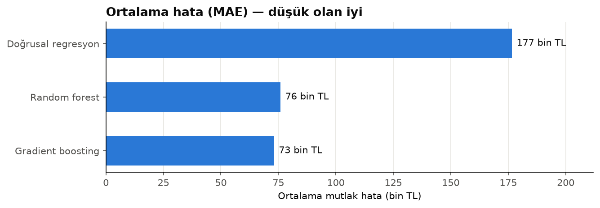
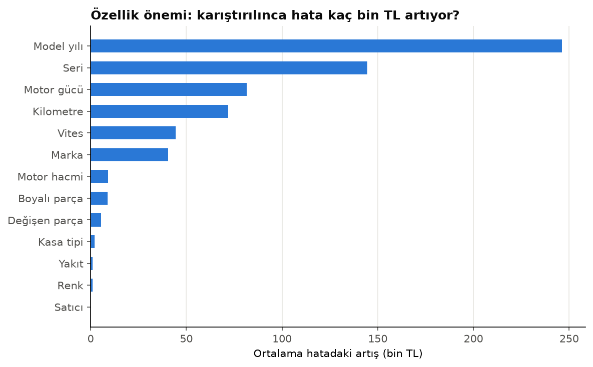

# İkinci El Araç Fiyat Tahmini

[Türkçe](#türkçe) · [English](#english)

arabam.com'daki ~50 bin ilanla eğitilmiş, bir aracın ikinci el fiyatını tahmin eden makine öğrenmesi modeli ve herkesin kullanabileceği bir web arayüzü.

### 🚗 [Uygulamayı canlı dene](https://arac-fiyat-tahmini.streamlit.app)



---

## Türkçe

### Sonuç

Model, hiç görmediği 10.000 ilanda **ortalama 73.200 TL**, tipik bir ilanda **%7,2** yanılıyor (R² = 0,944).

| Model | Ortalama hata | Tipik hata | R² | Dosya |
|---|---:|---:|---:|---:|
| Doğrusal regresyon | 176.648 TL | %16,1 | 0,673 | ~0 MB |
| Random forest | 76.008 TL | %7,3 | 0,941 | 95 MB |
| **Gradient boosting** ✅ | **73.200 TL** | **%7,2** | **0,944** | **0,5 MB** |

Random forest hatayı doğrusal modele göre yarıdan fazla düşürdü ama dosyası 95 MB — GitHub sınırına dayanıyor ve ücretsiz sunucuda uygulamayı yavaşlatırdı. Gradient boosting aynı (biraz daha iyi) doğruluğu **~200 kat küçük** bir dosyayla yakaladığı için yayına o alındı.

### Bulgular

1. **Fiyatı en çok model yılı belirliyor**, ardından seri, motor gücü ve kilometre geliyor. Renk ve satıcı tipinin (sahibinden / galeriden) etkisi neredeyse sıfır.
2. **Yüzde hata ucuz araçlarda daha yüksek:** en ucuz %20'lik dilimde (100–320 bin TL) tipik hata %11,8, en pahalı dilimde %5,6. Ucuz araçlarda durum/bakım farkları fiyatı daha çok oynatıyor ve bu bilgi ilanda yok.
3. Veri seti **marka başına eşit örneklenmiş** (ilk ~30 markanın her birinden ~2.490 ilan). Model her markayı eşit iyi öğreniyor, ama bu veriyle "en çok satılan marka" gibi piyasa analizleri yapılamaz.



### Nasıl yapıldı

1. **İnceleme:** eksik değerler, aykırı değerler (90 milyon km, 595 milyon TL gibi hatalı ilanlar), fiyat dağılımı
2. **Temizlik:** fiyatın uç %0,5'lik dilimleri, 1 milyon km üstü, 1980 öncesi ve 600 hp üstü araçlar atıldı → 50.000 ilan, **100 bin – 7 milyon TL** aralığı
3. **Hazırlık:** kategorik sütunlar doğrusal model için one-hot, ağaç modelleri için ordinal kodlandı; 30'dan az ilanlı seriler "nadir" grubunda toplandı; değişen/boyalı bilgisi eksikse "bilgi yok" işaretiyle dolduruldu
4. **Hedef:** fiyatın logaritması — model hatayı oransal düşünüyor (300 bin TL'lik araçta 50 bin hata büyük, 5 milyonlukta küçük)
5. **Modeller:** doğrusal regresyon → random forest → gradient boosting; %80 eğitim / %20 test
6. **Arayüz:** Streamlit; seri seçilince motor, yakıt, vites ve kasa alanları o serinin tipik değerleriyle doluyor, sonuç ±%7'lik makul aralıkla gösteriliyor

Tüm adımlar açıklamalarıyla [`model_egitimi.ipynb`](model_egitimi.ipynb)'de.

### Dosyalar

| Dosya | Görevi |
|---|---|
| `model_egitimi.ipynb` | İnceleme, temizlik, üç modelin eğitimi ve karşılaştırması, grafikler |
| `model/fiyat_modeli.joblib` | Eğitilmiş model (0,5 MB) |
| `model/secenekler.json` | Arayüzün marka/seri listeleri, serilerin tipik değerleri, modelin hata oranı |
| `tahmin.py` | Modeli yükleyip tahmin yapan modül |
| `app.py` | Streamlit arayüzü |
| `tests/` | Tahmin modülü için testler (yeni araç daha pahalı mı, çok km'li araç daha ucuz mu…) |

### Çalıştırma

```bash
pip install -r requirements-egitim.txt
# Veri: kaggle.com/datasets/mehmettanriverdi/used-car-prices-dataset-turkey-arabam-com
#       car_price_prediction.csv dosyasını data/ klasörüne koy
jupyter notebook model_egitimi.ipynb   # modeli yeniden eğitmek için
streamlit run app.py                   # arayüz
pytest
```

### Veri

- **Kaynak:** [Used Car Prices Dataset (Turkey – arabam.com)](https://www.kaggle.com/datasets/mehmettanriverdi/used-car-prices-dataset-turkey-arabam-com), Kaggle — 50.755 ilan, **Ağustos 2025**
- Lisans ticari olmayan kullanıma izin veriyor; ham veri bu repoda yer almıyor.
- Fiyatlar Ağustos 2025 piyasasını yansıtır; enflasyon nedeniyle bugünkü fiyatlar daha yüksektir. Arayüz bunu açıkça belirtiyor.

### Neyi farklı yapardım

- **Güncel veri ve düzenli yeniden eğitim.** Türkiye'de fiyatlar hızla değiştiği için model birkaç ayda eskiyor. Verinin düzenli toplanıp modelin otomatik yeniden eğitilmesi (fiyat takip botundaki gibi GitHub Actions ile) gerçek bir ürün için şart.
- **Donanım paketi bilgisi.** 3.300 farklı değer içerdiği için `model` sütununu (ör. "1.6 TDI Style") kullanmadım. Bunu motor tipi / donanım seviyesi gibi daha az sayıda anlamlı gruba ayırmak, özellikle aynı serinin farklı paketleri arasındaki fiyat farkını yakalayıp hatayı düşürürdü.

---

## English

**Used car price prediction.** A machine learning model trained on ~50K arabam.com listings (Turkey, August 2025) that estimates a car's used price, served through a [Streamlit web app](https://arac-fiyat-tahmini.streamlit.app).

**Result:** on 10,000 unseen listings the model is off by **73,200 TL on average** and **7.2% for a typical listing** (R² = 0.944). Linear regression (MAE 176,648 TL) was the baseline; random forest halved the error but produced a 95 MB file; gradient boosting matched it (slightly better) at **~200× smaller (0.5 MB)**, so that's the deployed model.

**Findings:** model year matters most, then series, engine power and mileage — colour and seller type barely matter; percentage error is higher for cheap cars (11.8% in the bottom price quintile vs 5.6% at the top); the dataset is sampled evenly per brand, so it's fine for modelling but not for market-share analysis.

**Approach:** EDA → outlier removal (50,000 listings, 100K–7M TL) → one-hot / ordinal encoding with rare-category grouping and missing-value indicators → log-price target → linear regression vs random forest vs gradient boosting (80/20 split) → Streamlit app that pre-fills typical specs for the chosen series and shows a ±7% range.

**Stack:** Python · pandas · scikit-learn · matplotlib · Streamlit · pytest

**Data:** [Kaggle — Used Car Prices Dataset (Turkey – arabam.com)](https://www.kaggle.com/datasets/mehmettanriverdi/used-car-prices-dataset-turkey-arabam-com), non-commercial license; raw data not included in this repo. Prices reflect August 2025.

**What I'd do differently:** schedule regular data collection and retraining (prices in Turkey move fast), and group the 3,300-value trim column into a few meaningful levels to capture price gaps within the same series.
